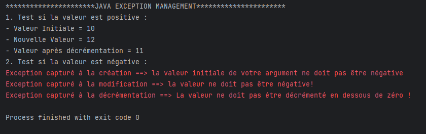
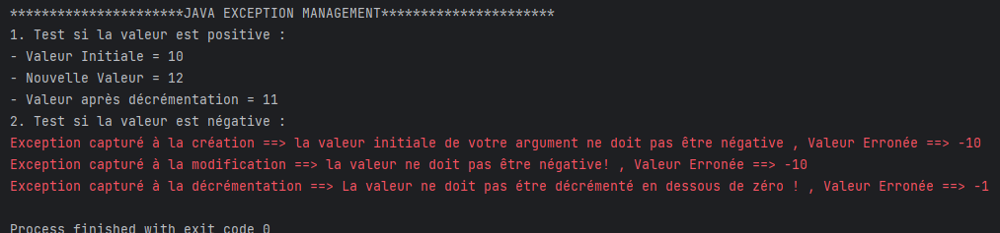
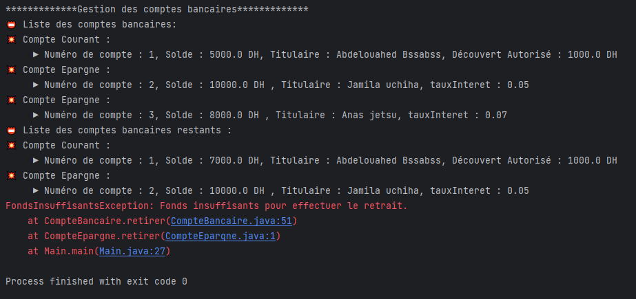
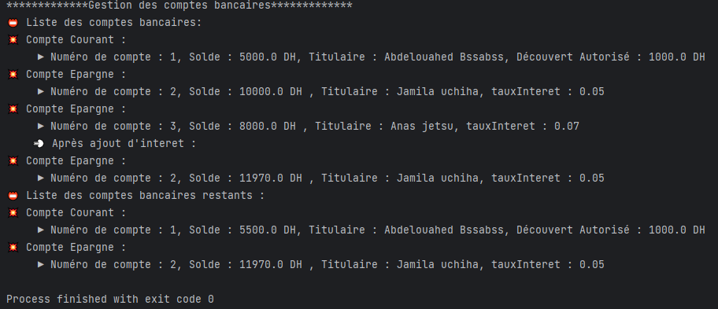

<h1>Gestion des Exceptions</h1>
<ul>
  <h2>Exercice 1</h2>
  <li>Resultat sans ajout de la valeur erronnée :</li>
  
  <li>Resultat avec ajout de la valeur erronnée :</li>
  
</ul>

<ul>
  <h2>Exercice 2</h2>
  <li>Resultat avec message d'erreur</li>
  
  <li>Resultat sans message d'erreur</li>
  
</ul>
